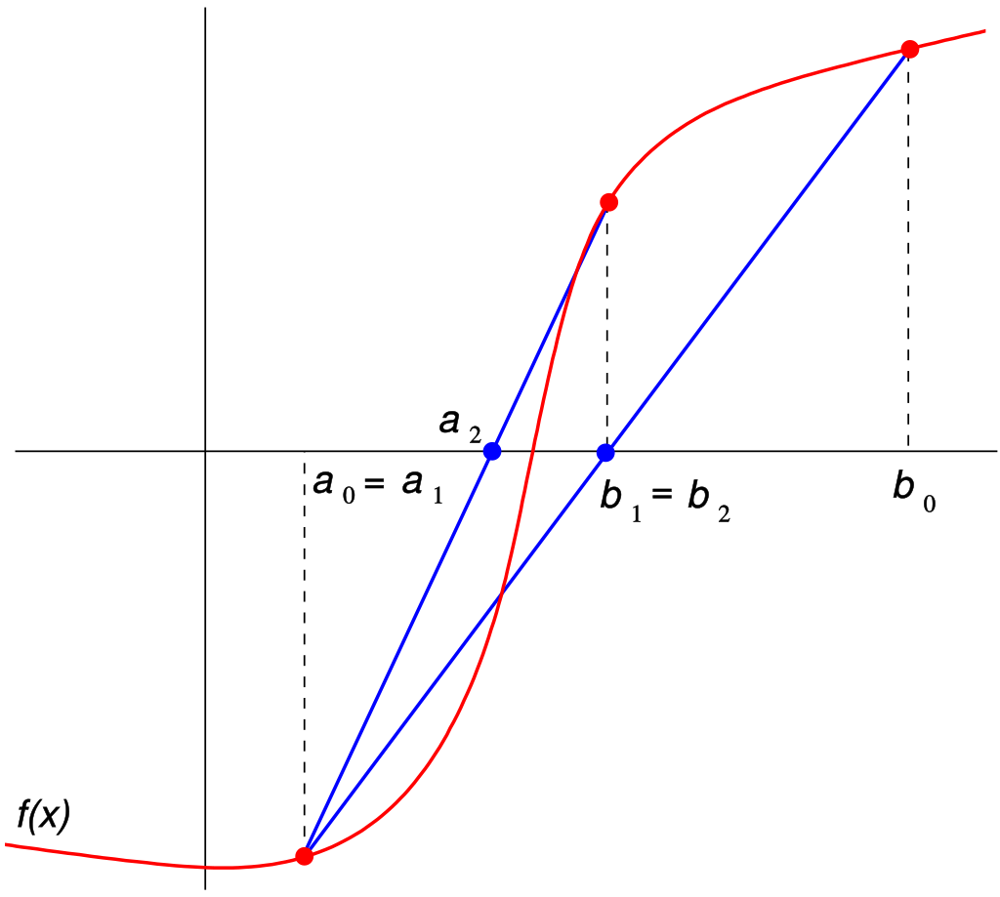

# Pràctica 4: Resolució d'Equacions amb el Mètode de la Bisecció

En aquesta pràctica, desenvolupareu un programa en Python que utilitza el **mètode de la bisecció** per resoldre equacions de la forma $f(x) = 0$, on $f(x)$ és una funció contínua. També es proposa implementar una millora opcional amb el **mètode de la falsa posició**.

## Objectius

- Implementar el mètode de la bisecció per aproximar solucions d’equacions.
- Entendre el concepte del teorema de Bolzano i el mètode de la bisecció per garantir l’existència de solucions en un interval.
- Millorar l’algorisme amb el mètode de la falsa posició (opcional).
- Avaluar el rendiment de l’algorisme comptant el nombre d’iteracions necessàries.

## Teoria Prèvia

Per trobar solucions d’equacions de la forma $f(x) = 0$, existeixen diversos mètodes numèrics. Un dels més naturals és el **mètode de la bisecció**. Aquest es basa en el **Teorema de Bolzano**, que afirma:

- Si $f(x)$ és una funció contínua i $f(a) \cdot f(b) < 0$, aleshores existeix (almenys) una solució $c \in (a, b)$ tal que $f(c) = 0$.

### Algorisme del Mètode de la Bisecció

1. **Avaluació del punt mig**: 
   - Es calcula el punt mig de l’interval $(a, b)$:  
     $x_m = \frac{a + b}{2}$
     
   - Es calcula $f(x_m)$.

2. **Reducció de l’interval**:
   - Si $f(x_m)$ té el mateix signe que $f(a)$, aleshores canviarem  $a$ per $x_m$ i el nou interval serà $(x_m, b)$.
   - Si no, canviarem $b$ per $x_m$ i el nou interval serà $(a, x_m)$.
   - Repetim el procés fins que la longitud de l’interval sigui menor que una tolerància $tol$ o $|f(x_m)| < tol$.

3. **Criteri d’aturada**:
   - Quan $|f(x_m)| < tol$, el punt $x_m$ és la solució aproximada de l’equació amb un error màxim de $tol$.


### Mètode de la Falsa Posició

Una alternativa al mètode de la bisecció és el **mètode de la falsa posició** (o **regula falsi**). En lloc d’utilitzar el punt mig $(a + b)/2$, es calcula el punt de tall de la recta entre els punts $(a, f(a))$ i $(b, f(b))$ amb l’eix $x$:

Aquest mètode pot ser més eficient en alguns casos, ja que redueix l’interval utilitzant una aproximació lineal de la funció.



## Enunciat

### Mètode de la bisecció

- Programeu l’algorisme en Python. El programa haurà de demanar a l’usuari que proporcioni
els valors a i b inicials pels quals la funció té signes contraris. La funció estarà definidia en el `main.py`
- Feu que el programa doni el nombre d’iteracions que ha necessitat per trobar la solució.
- Criteri d'aturada del programa: Quan $|f(x_m)| < tol$, el punt $x_m$ és la solució aproximada de l’equació amb un error màxim de $tol$ on $tol=10^-10$

### Millora opcional

- Implementar la funció que executi l'algorisme del **mètode de la falsa posició** i comparar temps d'execució per a diferents funcions donant les mateixes dades d'entrada.

## Estructura del projecte

### Fitxer `main.py`

El fitxer principal contindrà:

- Definició de la funció \(f(x)\) i mostrar-la a l'usuari.
- Definició de la tolerància \(tol=10^-10\).
- La lògica per obtenir l’entrada de l’usuari: \(a\), \(b\).
- Comprovació que \(a\) i \(b\) compleixen les condicions del Teorema de Bolzano.
- Crides a les funcions implementades al fitxer `funcions.py` les quals implementen el mètode de bisecció (i mètode de la falsa posició si és el cas)
- Mostra dels resultats, incloent la solució \(x_b\), el valor de la funció \(f(x_b)\) en aquest punt i el nombre d’iteracions.

### Fitxer `funcions.py`

Contindrà les funcions següents:

- `compleix_bolzano(f, a, b)`: comprova que compleix les condicions del Teorema de Bolzano.
- `biseccio(f, a, b, tol)`: implementa el mètode de la bisecció i retorna la solució \(x_b\), el valor de \(f(x_b)\) i el nombre d’iteracions.
- `falsa_posicio(f, a, b, tol)`: implementa el mètode de la falsa posició i retorna la solució \(x_b\), el valor de \(f(x_b)\) i el nombre d’iteracions.

## Exemples d'execució

### Entrada

```python
a = 1 # Demanat a l'usuari
b = 2 # Demanat a l'usuari
tol = 1e-10
f(x) = x**3 - 2  # Equació: x³ - 2 = 0
```

### Sortida

```bash
Dades d'entrada:

Funció: f(x) = x**3 - 2
Tolerància: 1e-10
Valor a: 1
Valor b: 2

Resultat d'aplicar el Mètode de la Bisecció:
Solució aproximada: x_b = 1.2599210498948732
f(x_b) = -1.1102230246251565e-16
Nombre d’iteracions: 34
```
